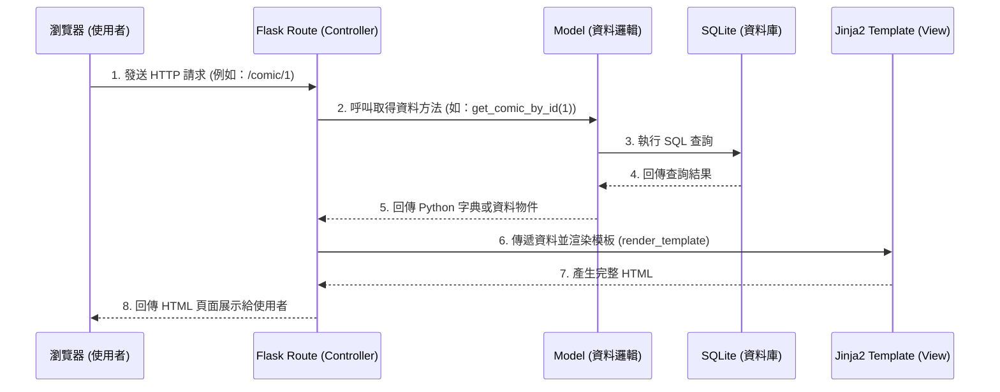

# 漫畫推薦系統 - 系統架構文件 (Architecture)

## 1. 技術架構說明

本系統採用經典的後端渲染架構，以 Python 為核心語言，搭配輕量級的 Flask 框架進行開發。此架構能快速建立原型，適合做為最小可行性產品（MVP）。

- **選用技術與原因**：
  - **後端框架 (Flask)**：輕量、彈性高，適合中小型專案快速開發，學習曲線平緩。
  - **模板引擎 (Jinja2)**：與 Flask 完美整合，能夠在後端將資料與 HTML 結合後，直接回傳完整的網頁給前端，不需要額外設定複雜的前後端分離架構。
  - **資料庫 (SQLite)**：內建於 Python，不需額外安裝與維護獨立的資料庫伺服器，非常適合開發階段與 MVP 使用，方便攜帶與部署。

- **Flask MVC 模式說明**：
  - **Model (模型)**：負責與 SQLite 資料庫互動，處理資料的讀寫邏輯（例如：從資料庫查詢指定種類的漫畫、新增使用者的書評）。
  - **View (視圖)**：負責呈現畫面，由 Jinja2 模板（Templates）與靜態檔案（CSS/JS/Images）組成，將後端傳來的資料渲染成使用者看到的最終網頁。
  - **Controller (控制器)**：由 Flask 的 Routes（路由）擔任，負責接收使用者的 HTTP 請求（例如點擊某個漫畫連結、送出搜尋表單），呼叫 Model 取得所需的資料，再將資料傳遞給 View 進行渲染與回傳。

## 2. 專案資料夾結構

系統採用以下結構，將不同職責的程式碼分離，保持專案整潔：

```text
web_app_development2/
├── app/
│   ├── __init__.py      # 初始化 Flask 應用程式與設定檔
│   ├── models/          # Model：資料庫模型與資料操作邏輯
│   │   ├── __init__.py
│   │   ├── comic.py     # 漫畫相關操作 (查詢、分類過濾、推薦邏輯)
│   │   └── review.py    # 書評相關操作 (新增、讀取留言)
│   ├── routes/          # Controller：路由處理 (可使用 Flask Blueprints)
│   │   ├── __init__.py
│   │   ├── main.py      # 首頁、排行榜、推薦等主要路由
│   │   └── comic.py     # 單一漫畫介紹頁、分類查詢、搜尋等路由
│   ├── templates/       # View (HTML)：Jinja2 模板
│   │   ├── base.html    # 共用版型 (包含導覽列、頁尾)
│   │   ├── index.html   # 首頁 (推薦、排行榜區塊)
│   │   ├── detail.html  # 漫畫詳細資訊與書評區
│   │   └── list.html    # 搜尋結果與分類篩選列表
│   └── static/          # View (Assets)：靜態資源
│       ├── css/
│       │   └── style.css# 共用樣式表
│       ├── js/
│       │   └── main.js  # 前端互動邏輯 (選單展開等簡單動態效果)
│       └── images/      # 預設封面圖片等素材
├── instance/
│   └── database.db      # SQLite 資料庫檔案
├── docs/
│   ├── PRD.md           # 產品需求文件
│   └── ARCHITECTURE.md  # 系統架構文件 (本文件)
├── app.py               # 專案啟動入口點
└── requirements.txt     # Python 依賴套件清單 (Flask 等)
```

## 3. 元件關係圖

以下展示使用者在瀏覽器操作時，系統內部的資料流向與元件互動關係：



## 4. 關鍵設計決策

1. **傳統後端渲染 (Server-Side Rendering, SSR)**
   - **決策**：前端畫面由 Flask 搭配 Jinja2 產生，而非使用 React/Vue 透過 API 串接。
   - **原因**：為了符合 MVP 快速開發的需求並降低複雜度，SSR 對於單純的內容展示（如漫畫列表、文章介紹）具有良好的 SEO，且不用維護兩套獨立的專案（前後端分離）。

2. **模組化的路由與模型設計**
   - **決策**：將路由分為 `main.py`, `comic.py` 等獨立檔案；模型分為 `comic.py`, `review.py`。
   - **原因**：隨著功能增加，單一的 `app.py` 會變得過於龐大且難以維護。依據業務功能拆分可以讓專案結構更清晰，團隊分工也較不會產生衝突。

3. **使用 SQLite 作為開發與初期儲存方案**
   - **決策**：不架設 MySQL 或 PostgreSQL，直接使用 SQLite 的檔案型資料庫 (`instance/database.db`)。
   - **原因**：設定極簡，不需要額外配置或部署資料庫伺服器。對於初期的漫畫資料庫與書評系統而言，SQLite 的效能足以應付。

4. **將商業邏輯與資料庫操作集中於 Model 層**
   - **決策**：將如「尋找相似漫畫」、「獲取推薦排行榜」等邏輯實作於 `models/` 目錄中，不直接寫在 Route 裡。
   - **原因**：保持 Route 乾淨（僅負責接收 Request 與回傳 Response），並提高程式碼重用性。例如，首頁與搜尋頁可能都會呼叫同一支「取得漫畫清單」的 Model 方法。
