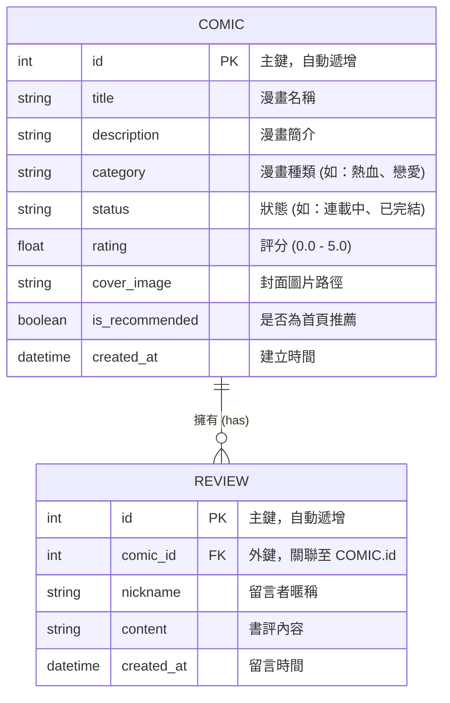

# 漫畫推薦系統 - 資料庫設計文件 (DB Design)

## 1. ER 圖 (實體關係圖)

描述漫畫與書評之間的關聯。一部漫畫可以有多則書評（一對多關係）。



---

## 2. 資料表詳細說明

### 2.1 COMIC (漫畫資料表)

| 欄位名稱 | 型別 | 說明 | 必填 | 備註 |
| --- | --- | --- | --- | --- |
| id | INTEGER | 主鍵 | 是 | PRIMARY KEY AUTOINCREMENT |
| title | TEXT | 漫畫名稱 | 是 | |
| description | TEXT | 漫畫簡介 | 否 | |
| category | TEXT | 漫畫種類 | 是 | 如：熱血, 戀愛, 奇幻 |
| status | TEXT | 連載狀態 | 是 | 連載中 / 已完結 |
| rating | REAL | 評分 | 否 | 預設 0.0 |
| cover_image | TEXT | 封面圖片路徑 | 否 | 存放在 static/images/ |
| is_recommended| INTEGER | 是否推薦 | 是 | 0: 否, 1: 是 |
| created_at | DATETIME| 建立時間 | 是 | 預設 CURRENT_TIMESTAMP |

### 2.2 REVIEW (書評資料表)

| 欄位名稱 | 型別 | 說明 | 必填 | 備註 |
| --- | --- | --- | --- | --- |
| id | INTEGER | 主鍵 | 是 | PRIMARY KEY AUTOINCREMENT |
| comic_id | INTEGER | 關聯漫畫 | 是 | FOREIGN KEY |
| nickname | TEXT | 留言者暱稱 | 是 | |
| content | TEXT | 書評內容 | 是 | |
| created_at | DATETIME| 留言時間 | 是 | 預設 CURRENT_TIMESTAMP |

---

## 3. SQL 建表語法 (database/schema.sql)

```sql
-- 建立漫畫表
CREATE TABLE IF NOT EXISTS comics (
    id INTEGER PRIMARY KEY AUTOINCREMENT,
    title TEXT NOT NULL,
    description TEXT,
    category TEXT NOT NULL,
    status TEXT NOT NULL,
    rating REAL DEFAULT 0.0,
    cover_image TEXT,
    is_recommended INTEGER DEFAULT 0,
    created_at DATETIME DEFAULT CURRENT_TIMESTAMP
);

-- 建立書評表
CREATE TABLE IF NOT EXISTS reviews (
    id INTEGER PRIMARY KEY AUTOINCREMENT,
    comic_id INTEGER NOT NULL,
    nickname TEXT NOT NULL,
    content TEXT NOT NULL,
    created_at DATETIME DEFAULT CURRENT_TIMESTAMP,
    FOREIGN KEY (comic_id) REFERENCES comics (id)
);
```

---

## 4. Python Model 程式碼規劃

Model 將存放在 `app/models/` 資料夾下，使用 `sqlite3` 模組進行操作。

- `app/models/comic.py`: 處理漫畫的查詢、搜尋與推薦邏輯。
- `app/models/review.py`: 處理書評的寫入與讀取。
