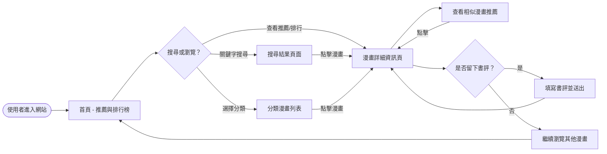
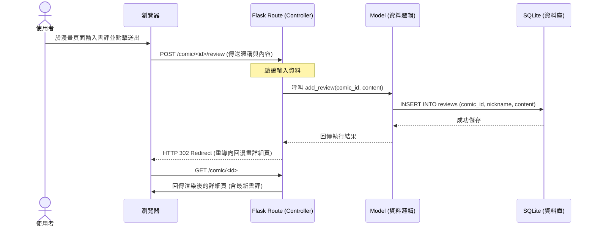

# 漫畫推薦系統 - 流程圖文件 (Flowchart)

## 1. 使用者流程圖 (User Flow)

描述使用者進入網站後的各種操作路徑，包含瀏覽、搜尋、分類查看以及留下書評。

---

## 2. 系統序列圖 (Sequence Diagram)

以「使用者留下書評」為例，描述從前端操作到後端儲存的完整資料流向。

---

## 3. 功能清單對照表

以下列出系統主要功能對應的 URL 路徑與 HTTP 方法，供開發路由時參考。

| 功能名稱 | URL 路徑 | HTTP 方法 | 說明 |
| --- | --- | --- | --- |
| 首頁 / 推薦榜 | `/` | GET | 顯示首頁、推薦漫畫及熱門排行榜 |
| 搜尋結果 | `/search` | GET | 依關鍵字搜尋漫畫，並顯示相似推薦 |
| 分類列表 | `/category/<category_name>` | GET | 顯示特定種類（如熱血、戀愛）的漫畫 |
| 漫畫詳細資訊 | `/comic/<int:comic_id>` | GET | 顯示單一漫畫詳細資料、狀態及書評列表 |
| 提交書評 | `/comic/<int:comic_id>/review` | POST | 接收使用者提交的書評資料並儲存 |

---

## 4. 說明與備註

- **首頁推薦邏輯**：初步實作將以資料庫中的「推薦標記」或「評分高低」作為排序依據。
- **相似推薦邏輯**：當使用者在搜尋或查看詳細頁時，系統會比對同種類 (Category) 的其他漫畫進行展示。
- **漫畫狀態標示**：在所有列表頁與詳細頁中，系統均會從資料庫讀取 `status` 欄位（連載中/已完結）並清楚顯示。
